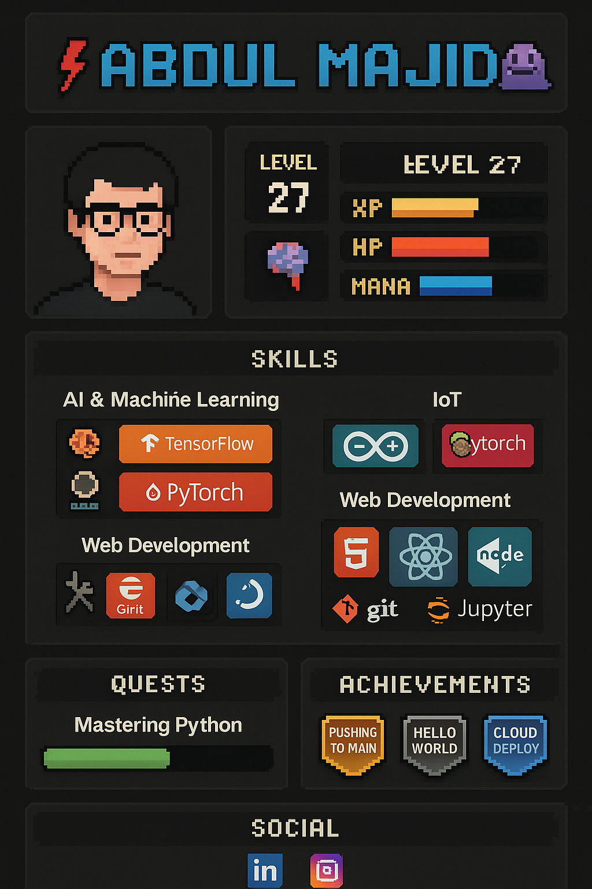

<h1 align="center">
  ⚡ ABDUL MAJID 🧠
</h1>

  

---

## 🧙‍♂️ Character Sheet

| Stat       | Value              |
|------------|--------------------|
| **Level**  | 27 (still grinding) |
| **XP**     | ███████░░░ 70%     |
| **HP**     | ██████░░░░ 60%     |
| **Mana**   | ██████████ 100%    |
| **Class**  | ⚙️ AI Mage / IoT Engineer / Frontend Spellcaster |

---

## 🛠️ Skills & Builds

### 🧠 AI & Machine Learning

### 🔌 Internet of Things

### 🌐 Web Development

---

## 🎯 Active Quests

- [x] Learn to tame PyTorch dragons
- [x] Build IoT projects that actually boot 🥲
- [ ] Contribute to OSS without breaking main branch
- [ ] Survive full-stack deployment without crying

---

## 🏆 Achievements Unlocked

> “Achievement: Survived 3 hours debugging a missing semicolon.”

---

## 🕹️ Inventory

### Tools & IDEs

---

## 📡 Join My Guild

📧 **Email**: [abdulmajidr708@gmail.com](mailto:abdulmajidr708@gmail.com)

---

## 💬 Fun Fact (Rage Edition)

> I once lost 3 hours debugging a bug that was fixed by restarting VS Code.  
> My machine learning model performed worse *after* tuning it.  
> My IoT project worked perfectly... but only when no one was watching.  
> Life is a loop. So is my code.

---

🕹️ *Explore my repositories if you dare. There's chaos, caffeine, and some really cursed solutions.*

